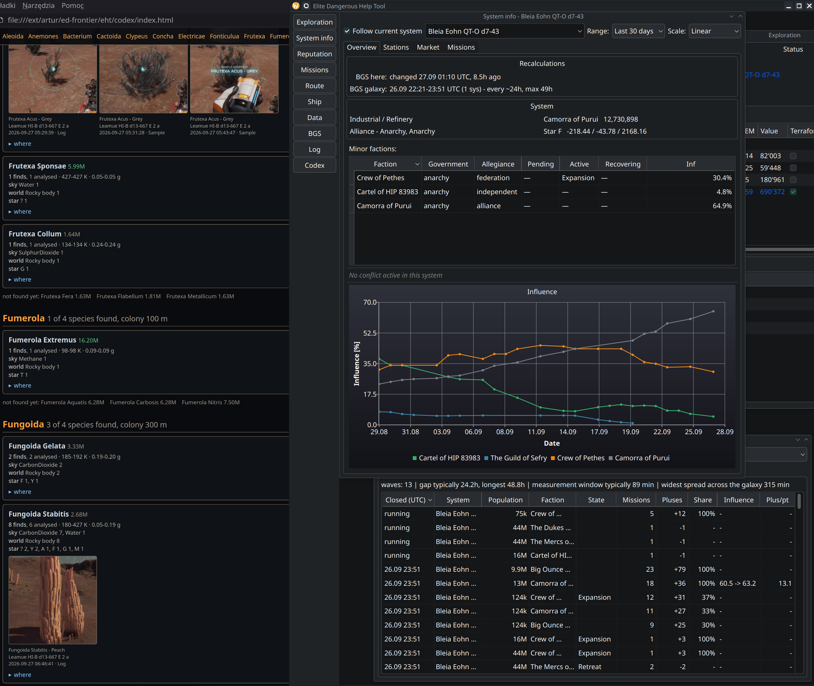

# elite_help_tool
Elite Dangerous companion: journal tracking and in-game overlay for exploration, exobiology and BGS

EHT (Elite Help Tool) is a companion for Elite Dangerous that follows the game's journal as you play and draws what matters straight into the game through a Vulkan overlay. It started as a way to plan exploration, deciding which planets are worth mapping and in what order. Since then it has grown to cover exobiology with species prediction and a codex, BGS work with tick tracking and influence history, missions, trade and in-game screenshots. Written in C++23, out of my own love of exploring the galaxy.

> **Linux only, for now.** EHT and its in-game overlay are built and tested only on Linux, with
> Elite Dangerous running under Proton.

## Documentation

- [Building, installing and running](doc/building_and_running.md): build, overlay install, first
  journal scan, starting EHT, Steam launch options, F11 screenshots
- [Running Elite Dangerous on Linux without Steam, with EHT](doc/elite_without_steam.md)
- [Elite on several monitors: the Wine virtual desktop, borderless under KWin](doc/wine_virtual_desktop.md)
- [How the BGS tick window is worked out](doc/bgs_tick.md)
- [Contributors](doc/contributors.md)

## In-game overlay

A Vulkan layer loaded into the game's process draws EHT's information straight into the frame. It
works in fullscreen, and under Wayland, where no other window may sit on top of the game. The
layer only draws what the tool sends it. The database and the logic stay in EHT, so the game
process carries no state of ours.

- **Side bands.** On a wide or triple screen the middle belongs to the game, so the blocks stay in
  the side bands and long text wraps instead of growing towards the centre.
- **Head-up readouts** flank the centre of the middle screen: the target in a fight, crew, and the
  sample in progress on foot. They give way to any interface that takes over that screen, such as
  the galaxy map.
- **Dogfights.** The target readout, on the left of centre, fills in as the scan goes: ship, pilot
  and combat rank, then hull and shield in per cent, then faction, legal status, bounty and the
  targeted subsystem with its health. On the right stand your hired pilot with their rank and the
  fighter's state: out and who flies it, in the bay, or destroyed and being rebuilt. A kill stays on
  screen for a few seconds with the credits it paid and the factions that paid them. When the danger
  is now (heat, an interdiction, the game's own danger warning), what a death would cost moves to the
  middle of the screen. Both readouts stand where you look during a fight, clear of the crosshair.
- **What stands where:** the system and its exploration work on the right, the station's market
  and mission cargo top right, the route, cargo, missions and what a death would cost on the left.
- **System map:** the bodies and ports of the current system, drawn in the game's colours, with
  arrows at the places open missions send you to.
- **Readable over anything.** The ground under each block darkens by how bright the game is
  beneath it, so the text stays legible over an ice planet as over black space.
- **F11** saves a screenshot of the whole screen, overlay included.

The layout (text size, band widths, where the readouts stand, opacity) comes from
`eht_settings.json` and changes live. The Steam launch option is one variable:
[doc/building_and_running.md](doc/building_and_running.md). How the layer works and why nothing in
it can take the game down: [overlay/README.md](overlay/README.md).

## BGS

- **Influence at a glance.** In a system, the overlay shows the factions with their influence and
  states, a chart of the last 20 days of influence, and the last tick.
- **Tick tracking.** The daily tick is reconstructed from your own journals as galaxy-wide waves,
  even though systems are visited rarely. The start of the wave is the deadline for handing in
  missions, and the influence tick and the war tick are kept apart:
  [doc/bgs_tick.md](doc/bgs_tick.md).
- **Effort against result.** The BGS window lists, per system, day and faction, the missions
  handed in, the pluses of influence pushed up or down, the influence before and after the tick,
  and the pluses it took per percentage point. That cost depends on the system's population, so it
  is never averaged across systems.
- **Wars.** The overlay counts the war ticks left until a conflict is settled, and says when the
  next one decides it. The BGS window lists the days won on both sides.
- **Settlements in a war.** On entering a system at war, the overlay shows each war's official
  state (sides, days won, status, what each side has at stake), the combat bonds not yet handed in
  for both sides (what the kills paid, and in brackets the likely payout: a hand-in pays about 3.3
  times that, the median of 386 hand-ins, since it adds sums the journal does not record), and every settlement of both sides with its owner when the war began and the
  intensity of its conflict zone on foot: `unknown`, `Low?` (seen in an earlier war; it never falls
  from one war to the next) or `Low` (confirmed in this one). The intensity is read from what a
  kill pays: the game pays kills on foot from fixed tables, low 1.9k–4.6k, medium 7.2k–33.8k,
  high 39.6k–87.4k per kill. The settlement a kill is made at is the one last approached, docked
  at, disembarked at or booked by dropship; a relog keeps it.
- `journal_tailer --ticks`, `--bgs` and `--wars` print the same analyses in the terminal.

## Mission tracking

- **Missions window**: every open mission with its status, type, description, faction, count,
  reward and destination, ready ones in their own colour. A *Massacre Stacking* tab sums the kills
  wanted and done per target system and faction.
- **On the overlay**: open missions grouped by the place they are owed to, with the time left, the
  giving faction and the owner of the destination. Missions ready to hand in are marked green, and
  those with less than 3 hours left turn red.
- **Where to go**: arrows on the system map at the bodies and ports missions send you to. At a
  settlement, what to hand in here, what to do here, and the faction-wide jobs that count at any
  settlement of that faction.
- **Who holds which settlement**: on foot in a port or at a settlement, where the mission boards
  are, a small list in the left band shows the system's settlements under the factions holding
  them, both in alphabetical order, each with its economy, flowing into a second and third column
  when long. The board
  never says whose a settlement is, and a job there moves that faction's influence. Only
  settlements you have visited or flown close to are known.
- **Mission cargo**: the goods delivery missions still need against what is in the hold, and the
  known markets and producers that supply them.
- **What is really paid**: the reward is taken from the hand-in, not from the offer, and missions
  the game no longer lists expire by themselves.
- **What a death would cost**: unsold exobiology, cartography and bounties at risk, moved to the
  middle of the screen when the danger is immediate.

## Trade

- **The station's market on the overlay**: what it pays above and sells below the galactic
  average, beyond 25% and 500 Cr/t, with minerals that pay well only from mining listed apart.
- **Best known trades**: what to bring here and what to take from here, against every market you
  have ever opened. Each line gives the margin per tonne, the tonnes (capped by your hold, the stock
  and the demand), the profit of the run and the station. With a route plotted, it looks for what to
  take to its end and what to bring back.
- **Fleet carrier bars**: the bartender's shelf of every carrier visited, with prices and sold-out
  items, filterable to your own carriers. Where each material came from is tracked too, collected
  or from missions, over 30 days, 90 days or all time.
- Market data is recorded when you open the commodity market, and kept in `live.sqlite`, the one
  database that cannot be rebuilt from journals.

## Colonisation

- **What a construction site still needs**: the game writes a site's whole state on every docking
  there (what it requires, what has been provided, its progress) and each delivery as it is handed
  in. EHT keeps both, so after dropping a load the rest is known at once.
- **Only our own systems**: the systems claimed by the commanders of this journal directory and not
  released, read from the claims in the journals. Only sites still under construction are listed.
- **On the overlay**, when the flight's destination is a construction site in the current system, when
  docked at one, or when it is chosen in the Construction window: the commodities still needed, most
  wanted first, with how much is in the hold and how much the port you stand at sells, and for how
  much. What can be loaded right here stands out, and the trading hints give way, since the load
  is the colony's.
- **The Construction window** lists the sites under way, and for the one chosen every commodity:
  what is left, required, provided, in the hold, and in the port you stand at.
- A site is known from the first docking at it: the game writes nothing when one is placed in the
  system map. Nor does it say that a site lapsed unless someone visits it, so a site can be marked
  abandoned in the window, which hides it; "Show abandoned" brings it back. The mark is kept in
  `live.sqlite`, since no journal records it.

## Fleet carriers

- **Where each carrier is, and where it goes.** For your own carrier and your squadron's, the overlay
  (with the logistics, bottom left) and the *Carriers* tab of the Data window show where it stands, or,
  once a jump is ordered: from where to where, when it leaves (UTC, with a countdown) and when it can
  jump again, five minutes after it left.
- The game writes a carrier's position at login and about a minute after a jump while you are in the
  game; when you are not, the carrier is taken to have arrived once the jump's cooldown has run out.
  A cancelled jump is dropped.

## Exploration and exobiology

The bottom right corner of the overlay follows the order of work in a new system:

1. **arrival** — whether the arrival star was discovered before ("discovered before - jump on") or is
   `UNDISCOVERED`, and how many bodies from the honk have been scanned already,
2. **to map** — bodies worth the probes, most valuable first, green when it is a first discovery,
3. **life** — bodies with biological signals and, for each genus, the species it most likely is on
   this world, with its price; green when it is worth landing for (`bio_worth`, 5M).

The species is guessed from your own history. Every species sampled is stored together with its
world (planet class, atmosphere, temperature, gravity, the star above it), and a genus on a new world
is compared with what has already been found under the same atmosphere. On 374 species from the
archive, guessing each one from the rest, the first answer is right in 302 cases and one of the first
two in 349. The more samples, the narrower the guess.

On the surface, in the place of the target panel left of centre, the sample in progress is shown:
species, price, 1/3–3/3 and the distance from the nearest earlier sample against the colony range,
counted live from `Status.json` — a green "sample" when you may take the next one. Below it, what else
grows on this body.

### Codex

With every sample the layer takes a picture of the centre of the screen (see `overlay/README.md`), and
the tool puts it in `codex/pictures/` next to itself, described in `codex/pictures.json`.
`codex/index.html` is written from the database at start and after every sample: family by family,
species by species — price, number of finds, temperature and gravity range, atmospheres, worlds and
stars, pictures, a table of systems and bodies, and what of the family has not been found yet. The
*Codex* button opens it. The pictures live in the directory, not in the database: the database can be
rebuilt from the journals, the pictures cannot.

Settings are in the `exploration` section of `eht_settings.json`: `bio_worth`, `bio_bodies`,
`candidates`, `capture`, `capture_size`, `codex_dir`, `jpeg_quality`.

## Privacy and your own galaxy

EHT is cut off from the public databases **in both directions**, on purpose.

**Nothing comes in.** EHT downloads nothing: no EDSM, no Spansh, no Inara, no species lists or
system dumps. Everything it knows comes from your own journals and your own Cargo, Market and
Status files. The galaxy in its databases is the galaxy *you* have flown, scanned and traded in.
That is what makes the knowledge yours: the species guessed on a new world come only from what you
have sampled yourself, so the prediction learns from your own work and gets better the more you
explore, instead of handing you someone else's answers. The only other source it will read is the
`galaxy.sqlite` of another of your own accounts, if you point `exploration.shared_galaxies` at it.

**Little goes out, and only what you allow.** The one connection EHT ever makes is to
[EDDN](https://github.com/EDCD/EDDN), the players' shared data network, and only when you turn it
on:

- **Off by default.** `eddn.enabled` is `false`, and `eddn.test` sends to EDDN's test schemas, which
  reach no one, until you set it to `false`.
- **Per commander.** Only the FIDs listed in `eddn.exploration_commanders` and
  `eddn.bartender_commanders` send anything, each only its own kind of data.
- **Exploration only of empty, undiscovered systems.** Scan events (FSDJump, Scan, FSS and SAA
  signals, barycentres, codex entries) are sent only for systems where the arrival star was
  undiscovered and nobody lives. A populated system is never sent, whoever found it. This keeps the
  systems where you do BGS work out of public view.
- **Only after you sell.** Exploration messages wait in `eddn_held.jsonl` until you sell that
  system's cartographic data. Until then nobody else learns what you found.
- **Fleet carrier bar stock** (`fcmaterials_journal/1`) is the only other thing sent, and only for
  the commanders listed for it.
- **No markets, missions, BGS or cargo** are ever sent, and where you are shows only through the
  exploration messages above, after the sale. Localised text is stripped as EDDN asks. The message header carries your commander name as `uploaderID`, as with every EDDN
  sender.

## Three databases

The data is split into three files lying side by side, because they differ in origin and owner:

| file | holds | rebuilt from journals | shared between accounts |
|---|---|---|---|
| `ehtdb.sqlite` | missions, loot, reputation, scanning progress | yes | **no** — belongs to one commander |
| `galaxy.sqlite` | systems, bodies, stations, factions, influence, conflicts | yes | yes |
| `live.sqlite` | markets, prices, the bartender's shelf | **no** | yes |

`ehtdb` is split from `galaxy` for one concrete reason: the world is the same for every commander,
but "what I have scanned and mapped" is not. Showing one commander that they mapped a planet which was
really mapped by the other leads straight to a wrong decision when planning a flight. That is why
`system_progress`, `body_progress`, `genus_progress` and `faction_reputation` stay in the personal
database and are keyed **naturally** — by system address, body id, faction name — and not by `oid`s,
which change with every rebuild of `galaxy.sqlite`.

Thanks to this two accounts can point by symlink at the same `galaxy.sqlite` and `live.sqlite`,
sharing knowledge of the galaxy and prices, while keeping their own missions, reputation and
exploration progress.

`journal_tailer` deletes and rebuilds `ehtdb.sqlite` and `galaxy.sqlite`; it leaves `live.sqlite`
untouched, because its contents cannot be rebuilt from the journals.
