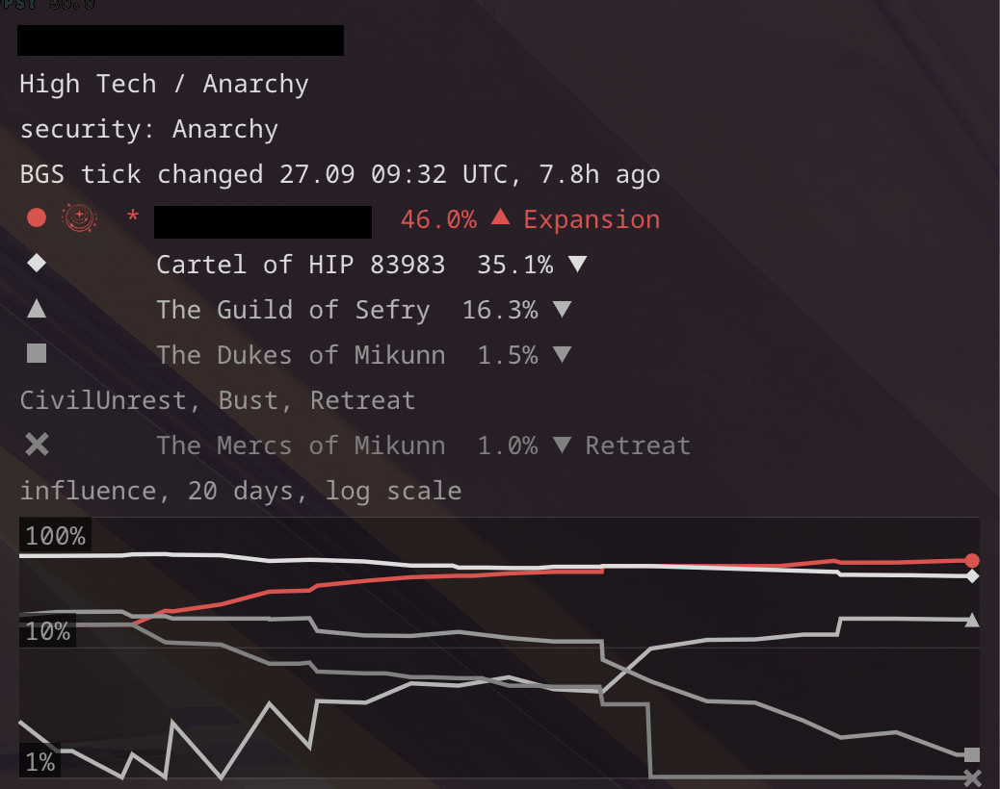

# BGS

- **Influence at a glance.** In a system, the overlay shows the factions with their influence and
  states, a chart of the last 20 days of influence, and the last tick. The states are the system's own:
  the journal's FactionState is a state of the faction taken from one of its systems, so a retreat
  from where it is weak would show in every system it is in. Once an Expansion ends, the faction
  enters a cooldown before it can expand again; while nothing is active, that cooldown is shown as
  `Expansion (cooldown)` instead of leaving the line blank.
- **Economy and security pushes.** The game shows each faction's economy and security as a bar
  with a trend, but writes neither to the journal. It does write which way each handed-in mission
  pushed them, so after a faction's states the overlay shows your own pushes since the last tick,
  up and down apart: `EP +5/-1  SP +2`. Security is left out for anarchies, whose security bar
  stays in the middle. Other commanders' work is not in it. The System info window has the same as
  columns, together with the influence pluses pushed since the tick.
- **Tick tracking.** The daily tick is reconstructed from your own journals as galaxy-wide waves,
  even though systems are visited rarely. The start of the wave is the deadline for handing in
  missions, and the influence tick and the war tick are kept apart: [bgs_tick.md](bgs_tick.md).
- **Effort against result.** The BGS window lists, per system, day and faction, the missions
  handed in, the pluses of influence pushed up or down, the influence before and after the tick,
  and the pluses it took per percentage point. That cost depends on the system's population, so it
  is never averaged across systems.
- **Wars.** The overlay counts the war ticks left until a conflict is settled, and says when the
  next one decides it. The BGS window lists the days won on both sides.
- **Settlements in a war.** On entering a system at war, the overlay shows each war's official
  state (sides, days won, status, what each side has at stake), the combat bonds not yet handed in
  for both sides (what the kills paid, and in brackets the likely payout: a hand-in pays about 3.3
  times that, the median of 386 hand-ins, since it adds sums the journal does not record), and every settlement of both sides with its owner when the war began and the
  intensity of its conflict zone on foot: `unknown`, `Low?` (seen in an earlier war; it never falls
  from one war to the next) or `Low` (confirmed in this one). The intensity is read from what a
  kill pays: the game pays kills on foot from fixed tables, low 1.9k-4.6k, medium 7.2k-33.8k,
  high 39.6k-87.4k per kill. The settlement a kill is made at is the one last approached, docked
  at, disembarked at or booked by dropship; a relog keeps it. What this means once you are actually
  fighting on the ground is in [missions_on_foot.md](missions_on_foot.md).
- **Territory.** The first tab of the BGS window sets every system your own factions are in side by
  side, each as it was last read: population, the controlling faction and its lead over the next one,
  your factions' influence with the last tick's move (a column each), the strongest rival, whether the
  system has been read since the tick wave began (and when it was read if not), your pushes since the
  tick, and what asks for attention - wars and elections with their days won, factions retreating, and
  one of yours below 2.5% before the game says Retreat. Above the table each of your factions gets a
  line: how many systems it controls of those it is in, its thinnest lead, and the system where it is
  least behind the controlling faction - the nearest one to take. Control changes only through a
  conflict, so the controlling faction is the one the game names, not the strongest; a lead below
  zero means it has been overtaken. List your factions by their names in the game in
  `bgs.own_factions`; a lead below `bgs.thin_lead` points (10) is marked. Nothing is forecast: a
  system not read since the tick shows no move.
- **Territory on the galaxy map.** While the galaxy map is open - where the next trip is chosen - the
  overlay shows the same in the right band, in small text: each faction's standing, then the systems
  nearest first with their distance, the controlling faction's lead, your factions' influence and
  last move (`*` marks the one in control), who holds the system when none of yours does, and in
  amber the systems whose tick you have not seen yet and what asks for attention there.
  `bgs.on_galaxy_map` turns it off, `bgs.overlay_systems` (12) sets how many systems it lists.
- `journal_tailer --ticks`, `--bgs`, `--wars` and `--territory` print the same analyses in the terminal.
