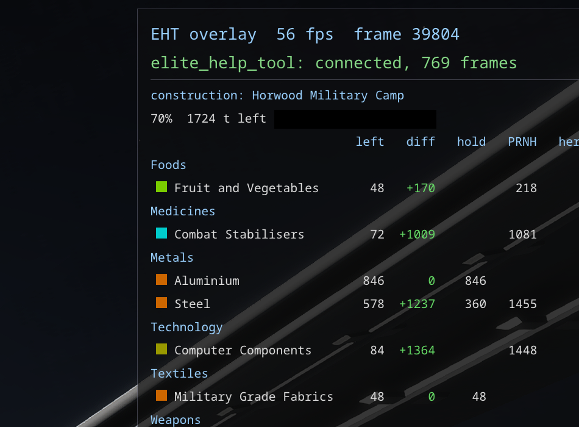

# Colonisation

- **What a construction site still needs**: the game writes a site's whole state on every docking
  there (what it requires, what has been provided, its progress) and each delivery as it is handed
  in. EHT keeps both, so after dropping a load the rest is known at once.
- **Only our own systems**: the systems claimed by the commanders of this journal directory and not
  released, read from the claims in the journals. Only sites still under construction are listed.
- **On the overlay**, when the flight's destination is a construction site in the current system, when
  docked at one, or when it is chosen in the Construction window: the commodities still needed, most
  wanted first, with how much is in the hold and how much the port you stand at sells, and for how
  much. What can be loaded right here stands out, and the trading hints give way, since the load
  is the colony's.
- **The Construction window** lists the sites under way, and for the one chosen every commodity:
  what is left, required, provided, in the hold, and in the port you stand at, grouped by type.
  The *Diff* column, in the window and on the overlay, sets the carrier the site is supplied from
  (chosen in the window and remembered for each site; all our carriers when none is) and the ship's
  hold against what is left: + what is to spare, - what is still to be brought, with that in all at
  the bottom.
- **A site finished** leaves the list at the last delivery, and becomes the settlement or station it
  turned into, under its new name and type. When the Construction window was on top, the System
  window takes its place, showing the place just built.
- **Who produces each commodity**: a square before its name, in the window and on the overlay, in the
  colours of the economies that produce it (Agriculture green, High Tech cyan, Industrial olive,
  Military purple, Refinery orange), split along the diagonal when several do; a dot marks what only
  ports on the ground produce. The window's tooltip names them. The table follows
  [RavenColonial](https://ravencolonial.com)'s.
- A site is known from the first docking at it: the game writes nothing when one is placed in the
  system map. Nor does it say that a site lapsed unless someone visits it, so a site can be marked
  abandoned in the window, which hides it; "Show abandoned" brings it back. The mark is kept in
  `live.sqlite`, since no journal records it.
