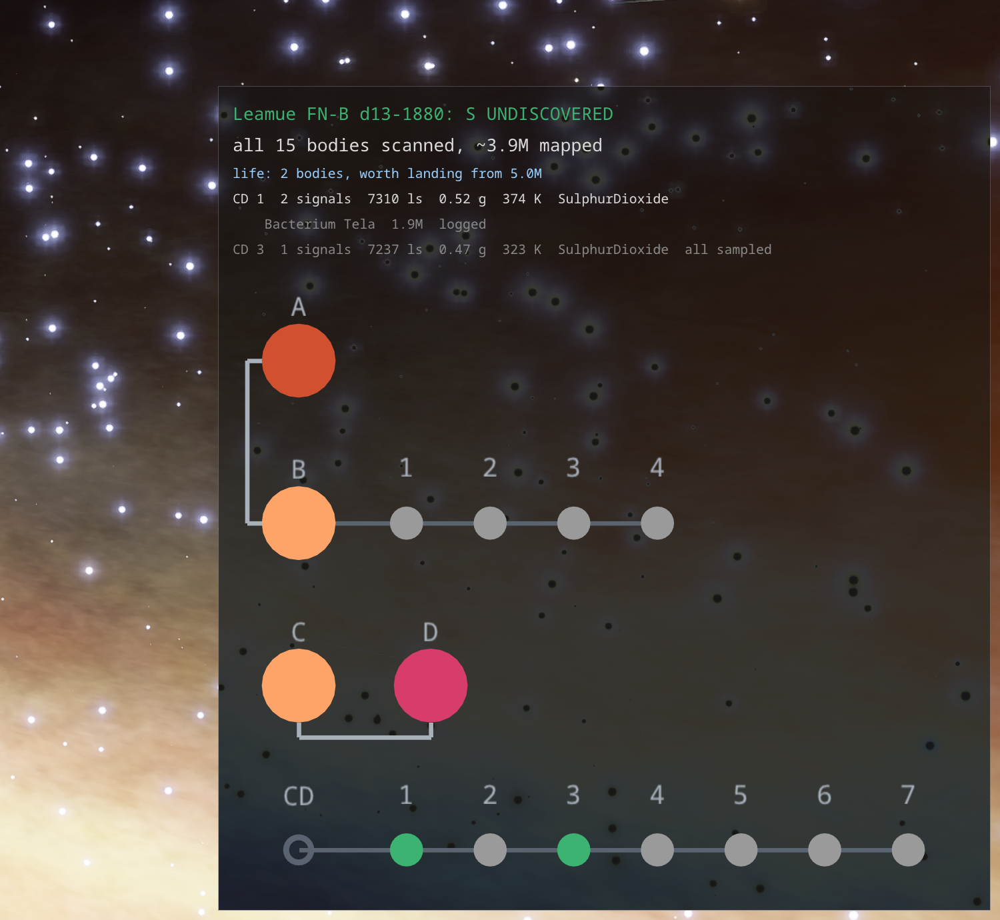
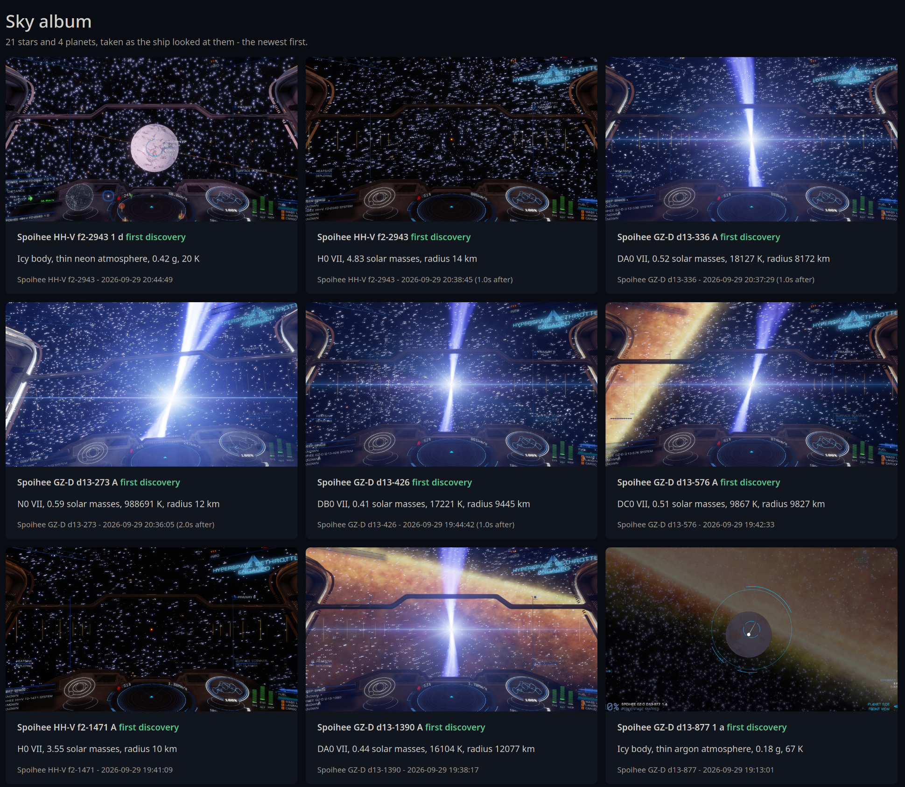

# Exploration and exobiology

The bottom right corner of the overlay follows the order of work in a new system:

1. **arrival** — whether the arrival star was discovered before ("discovered before - jump on") or is
   `UNDISCOVERED`, the star's radius in km and in light seconds, and how many bodies from the honk
   have been scanned already. The game writes neither where its exclusion zone ends nor how far the
   ship is from the star - that is only on the HUD - so the radius is the scale to read the HUD's
   distance against, which matters at a white dwarf or a neutron star, a few thousand km across.
   At a white dwarf a line says how far to keep: the game gives no warning before the drop, and the
   heat comes too late to be one. The figure is the HUD distance at which the danger began at one DC
   dwarf, 78 of its radii (`exploration.white_dwarf_danger_radii`), scaled by this dwarf's radius,
   with the number of measurements it rests on (`exploration.white_dwarf_measurements`),
2. **to map** — bodies worth the probes, most valuable first, green when it is a first discovery,
3. **life** — bodies with biological signals and, for each genus, the species it most likely is on
   this world, with its price; green when it is worth landing for (`bio_worth`, 5M).

The species is guessed from your own history. Every species sampled is stored together with its
world (planet class, atmosphere, temperature, gravity, the star above it), and a genus on a new world
is compared with what has already been found under the same atmosphere. On 374 species from the
archive, guessing each one from the rest, the first answer is right in 302 cases and one of the first
two in 349. The more samples, the narrower the guess.

Beside the guess stands what one scan would teach, in its own colour whatever the species pays: the
history of both accounts is asked what it knows of the genus on a world like this one. `new: genus`,
`new: atmosphere`, `new: 12 K warmer` (colder, heavier, lighter: past every find under this
atmosphere), `new: F star` (never under this kind of star - the variant may be a new one), or
`few like it (2)` (fewer than `exploration.little_known`, 3, finds within 5 K and a tenth of the
gravity). A genus seen often on such worlds gets no note, and a cheap one stays grey: nothing is left
to learn from it. A body with such a genus is listed in the same colour (`exploration.new_knowledge`).
The first scan is enough: it names the species and puts the world into the history.

On the surface, in the place of the target panel left of centre, the sample in progress is shown:
species, price, 1/3–3/3 and the distance from the nearest earlier sample against the colony range,
counted live from `Status.json` — a green "sample" when you may take the next one. Below it, what else
grows on this body. It shows in analysis mode or with the sampler in hand, in an SRV always - not in combat mode nor on foot
with a weapon.

**The System window** lists the bodies of the current system. Your own deeds sit in *Mapped* and
*Footfall* (you stepped onto the body - from the ship, an SRV or a taxi), the game's word on other
commanders in *Was Discovered*, *Was Mapped* and *Was Footfalled*, the last three in their own colour
(`gui.mapped_before_column`).

Navigating on foot to a codex entry or a place tipped off by a guide is its own window, in
[surface_navigation.md](surface_navigation.md).

**What cartography really pays.** The *Cartography* tab of the Data window lists every sale of
cartographic data in the journals: when, which systems, the bodies sold and those EHT could price,
EHT's estimate at the moment of the sale (the same reckoning as the cartography a death would cost),
and what the game paid - base, bonus and the sum that reached the account. The game writes one sum for
all the systems of a sale and nothing for a body, so only a sale of one system is an exact price;
over those the tab gives the base over the estimate (median, lowest, highest). The base is what the
bodies were worth, the first discovery included; the bonus is paid on top for a system scanned or
mapped in full, and a fleet carrier keeps a quarter of the base. Sell system by system to learn more.
Exobiology needs no such check: the price list agrees to the credit with every sample sold in the
archive, and the first-logged bonus is always four times the price.
`journal_tailer --cartography --dir <journals> --commander <FID>` prints the same.

**How a body is priced.** The formula in common use among explorers, corrected where the sales
disagree with it:

- a planet: `k + k * 0.56591828 * mass^0.2`, where `k` is the value of its class (with the
  terraformable bonus), times the mapping multiplier when mapped - 3.3333, or 3.6996 for the first
  discoverer who also maps it, or 8.0929 for the first to map a body someone else discovered,
- at least 500, then a third more and never less than 500 more (a small icy body is worth 1000),
- times 1.25 when mapped with no more probes than the target, times 2.6 for the first discovery,
- a star: `k + mass * k / 66.25` (1200 for an ordinary star, 14057 for a white dwarf, 22628 for a
  neutron star or a black hole), times 2.6 for the first discovery, and a third more for every star
  but the one the jump arrives at.

Over the single system sales of a station (not a carrier) from systems scanned in full, 69 of 83 agree
within a tenth of a percent. The rest are systems sold more than once, where the journal cannot tell
what was already paid for.

## Codex

With every sample the layer takes a picture of the centre of the screen (see
[overlay/README.md](../overlay/README.md)), and
the tool puts it in `codex/pictures/` next to itself, described in `codex/pictures.json`.
`codex/index.html` is written from the database at start and after every sample: family by family,
species by species — price, number of finds, temperature and gravity range, atmospheres, worlds and
stars, pictures, a table of systems and bodies, and what of the family has not been found yet. The
*Codex* button opens it. The pictures live in the directory, not in the database: the database can be
rebuilt from the journals, the pictures cannot.

What the pictures show can be, though. Every picture is named after the journal's timestamp of the
moment it was taken for (the sample, the jump, the scanner), so `pictures.json` and `sky/sky.json` are
a convenience, not the only record: at start, a picture missing from its list - the list lost, broken,
or the picture copied back from a backup - is described again out of the journals, and a list that
cannot be read is kept aside as `.broken`. Only the place of a sample on the ground is lost that way,
since it comes from `Status.json` and no journal has it. Backing up means copying the `codex/`
directory and the journals.

Settings are in the `exploration` section of `eht_settings.json`: `bio_worth`, `bio_bodies`,
`candidates`, `capture`, `capture_size`, `codex_dir`, `jpeg_quality`.

## Sky album

Out of a jump the ship faces the arrival star, and after the surface scanner closes it still faces the
planet it mapped. At those two moments the layer quietly takes a picture of 80% of the middle screen in
its own 16:9 shape (`exploration.sky_size`), with no frame and no countdown: the star after the jump, in
unpopulated space, tried at 1 s, 2 s and 3 s in turn (`sky_star_delays_ms`: at 0 s the tunnel is still on
the screen; the series stops at whichever attempt first finds the ship's own view, so a map or a scanner
opened during one attempt only costs that attempt, not the ones still to come), and the
planet as it stood before the scanner: in analysis mode, with a planet of this system set as the
destination, the view is taken every 2 s and kept aside; the scanner opening holds the last one, and
the mapping puts it into the album. Without such a view the planet is taken 1.5 s after the scanner
closes (`sky_planet_delay_ms`). The star's scan comes some seconds after the
jump, so the first pictures are described once it is in. Each body is taken once, and only from the ship's own view in supercruise -
a menu or the galaxy map open at the moment an attempt falls due drops that attempt alone. They go to
`codex/sky/<system>/`, named after the journal's moment of the jump or the scanner, are described in
`codex/sky/sky.json`, and `codex/sky.html` shows them with the
star's class, mass, temperature and radius or the planet's class, atmosphere, gravity and temperature,
and whether it was a first discovery. The *Sky* button opens it; `sky_pictures` turns it off.

## Faces of the planets

The balls of the overlay's system map get the faces of the bodies the surface scanner has been on,
dug out of pictures already kept. The scanner shows a body as a ball lit evenly all over, close to its
bare colours, and its views are kept under `codex/scanner/<body>/`. In each the ball is found - every
strong edge votes for the centres its gradient points at, the best centre takes the radius most of its
edges stand at - and a view is used only when the ball lies whole in it with most of its rim showing,
and no probe streaks across it. Of those the one least painted cyan wins: a filter paints the regions
of its genus cyan, a view without a filter has hardly any. Its ball is cut out to 128 px, and the
scanner's own marks on it - the white dot, the needle, the thin cyan rings - are filled from around
them. When every view is painted by a filter, only the relief is kept and the colour comes from the
lit side of the body in its sky album photo, or from its class when there is no photo.

The way to a body gives faces too, and in the body's true colours. With a planet of this system set as
the destination and the ship's own view in supercruise, the layer is asked for a small sample of the
middle of the screen four times a second: shrunk on the graphics card by halving it again and again,
each step the mean of 2 x 2 pixels, to a few hundred pixels across, and written into a file both
sides share (`captures/<socket>_sample.bin` beside the socket). The game waits for none of it - a few
microseconds a frame. Each sample is judged in a thread: the ball must be found whole in it - its
night side's rim may be lost against the black, and the edges in the HUD's cyan and orange do not
count, or the target's ring round its middle would be taken for a small ball - and the cockpit's frame must hide next to none of it.
It must also be large enough on the screen, 110 px of radius (`exploration.approach_radius_px`): the
size a planet has 1 Ls away, so a larger planet is taken from farther and a smaller one from nearer, in
proportion to its radius - farther off, the game draws a ball without the face it shows up close.
Larger than that is no better; the more of it in daylight the better, and the ship's orange HUD over it
counts against it. Only a sample better than the best face
kept asks for a real picture, and only of the rectangle the ball stands in, at most one every 2 s
(`exploration.approach_faces`, `approach_interval_ms`). The picture is judged again at its own size and
kept when it is at least as good. Its light is taken off before it is kept: the direction of the light
is fitted to the brightness over the ball, each pixel is divided by how squarely it faced the light,
and the night side is filled from the day side mirrored across the terminator. The target's ring, its
dot and the words written beside it are filled from around them like the scanner's marks. It is kept
in `live.sqlite` (table `approach_view`), the pixels packed with zstd and the score in the same row,
so the two are written together or not at all and travel with the backup's copy of `live.sqlite`: of
all a face is made from, this view is the one nothing can give back. Views an older build kept under
`codex/approach/` are taken in the first time their body is shown; the files stay. A scanner view in the body's own colours still
comes first; the cockpit's face comes before a scanner view painted by a filter.

The face is made in a thread of its own the first time the map shows the body, and made again when a
newer view comes in; it is written to `codex/faces/<body>.png` to be looked at - it is made again at
every start, never read back - and handed to the overlay beside the
socket. A body with life, whose flat ball is green, keeps its face and gets a green ring instead.
