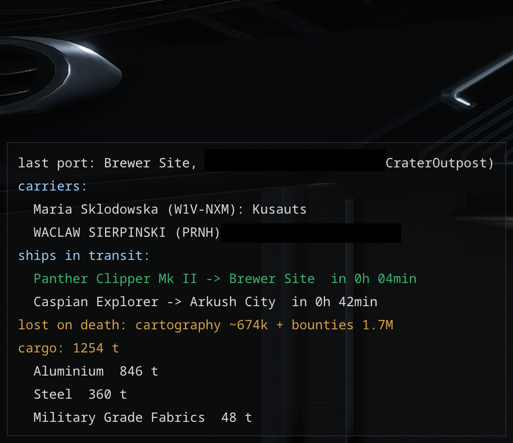

# Fleet carriers

- **Where each carrier is, and where it goes.** For your own carrier and your squadron's, the overlay
  (with the logistics, bottom left) and the *Carriers* tab of the Data window show where it stands, or,
  once a jump is ordered: from where to where, when it leaves (UTC, with a countdown) and when it can
  be sent on again, five minutes after it arrives. The overlay adds how far it is from you in light
  years, or from where it is going once a jump is ordered - out in deep space, how far the way back is.
  It needs both systems' positions, known once you have been to them.
- The game writes a carrier's position at login and about a minute after a jump while you are in the
  game, which is taken as the arrival; when you are not, the arrival is reckoned a minute after the
  departure, as the journals show, and the time is marked with a tilde.
- **What is on each carrier.** The game does not say what a squadron's carrier holds, so EHT keeps it:
  on docking at one of our carriers it notes the hold, and on leaving what the hold has less of is added
  to the carrier and what it has more of is taken off. A ship changed there - a small one taken so as
  not to run far across the pad - stays with its whole hold, and leaving by escape pod leaves the load
  too; taking the big ship back and flying off with its hold takes it off the carrier again. The *Carrier cargo* tab of the Data window shows it and lets you correct any count by hand, or add a
  commodity picked from the list of those not yet on the carrier, narrowed by default to what colonies
  are built from. Sales to other commanders at the carrier's market are not in the journal, so they
  need that correction too.
  It is kept in `live.sqlite`, as it cannot be rebuilt from journals, and it counts only while EHT runs.
- **In the colony's service**: the Construction window and the site on the overlay show, beside each
  commodity still needed, how much of it our carriers hold. On the overlay the column is headed by
  the callsign of the carrier the site is supplied from, when one is chosen in the Construction
  window; otherwise it is all our carriers together.
  A cancelled jump is dropped.

Fleet carrier bars (the bartender's shelf) are covered as a trading feature, in
[trade.md](trade.md).
