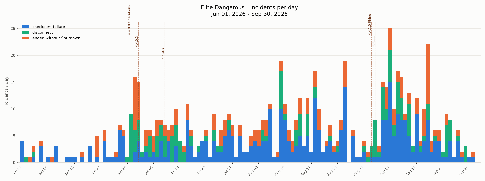
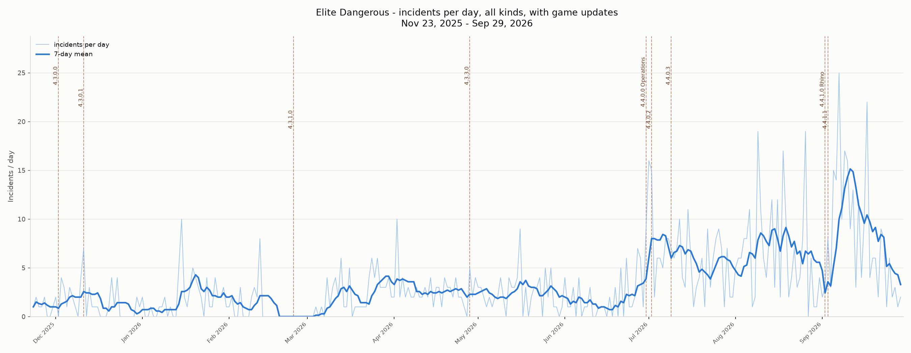
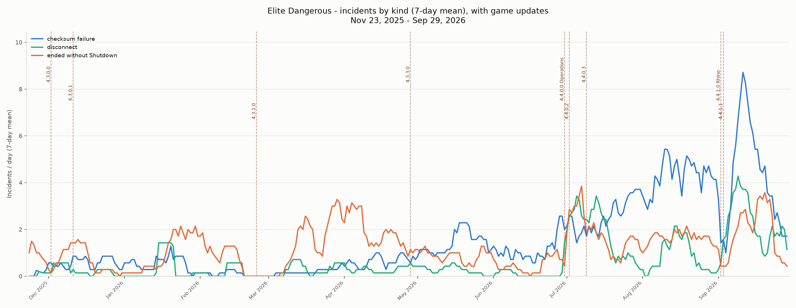

# Charts of your own connection incidents

Two small Python scripts in [`tools/incident_charts/`](../tools/incident_charts/) turn the game's own logs
into three charts of disconnects and failures over time. EHT is not needed: they read the folders the
game already writes. With EHT, the [Network](network_incidents.md) window's data can be plotted the
same way.

The charts below are from one commander's history, November 2025 to September 2026.







## What to run

You need Python 3.9 or newer and matplotlib (`pip install matplotlib`, or your distribution's package).
The commands below are written for Linux (bash). A full Linux example is under [On Linux](#on-linux),
and what differs on Windows is under [On Windows](#on-windows).

**1. Find the incidents** - `extract_incidents.py` reads both folders and writes `incidents.csv`:

```sh
python3 tools/incident_charts/extract_incidents.py \
    --netlog  "<netLog folder>" \
    --journal "<journal folder>" \
    --tz Europe/Warsaw \
    --out incidents.csv
```

- netLog folder: the `Logs` folder of the game's install, not the journal folder. On Windows with Steam
  it is `C:\Program Files (x86)\Steam\steamapps\common\Elite Dangerous\Products\elite-dangerous-odyssey-64\Logs`.
  Under Proton it is `<steam library>/steamapps/common/Elite Dangerous/Products/elite-dangerous-odyssey-64/Logs`.
- journal folder: `%USERPROFILE%\Saved Games\Frontier Developments\Elite Dangerous` on Windows,
  `<steam library>/steamapps/compatdata/359320/pfx/drive_c/users/steamuser/Saved Games/Frontier Developments/Elite Dangerous`
  under Proton.
- `--tz`: the time zone the game ran in (see below). Left out, the machine's own zone is used.
- Either folder may be left out; the newest journal is skipped unless `--include-newest-journal` is
  given, as the game may still be writing it.

netLog is written by default; nothing has to be enabled in the game's settings. The game does not
delete old netLog files, so the history goes back as far as the install.

**With EHT instead:** the incidents are already in `live.sqlite`:

```sh
sqlite3 -readonly -header -csv live.sqlite \
  "SELECT occurred AS occurred_utc, category, detail FROM network_incident ORDER BY occurred" > incidents.csv
```

**2. Draw the charts** - `plot_incidents.py` writes three PNG files:

```sh
python3 tools/incident_charts/plot_incidents.py incidents.csv --tz Europe/Warsaw \
    --from 2026-06-01 --to 2026-09-30 --out charts
```

`--from`/`--to` set the period of the daily chart only (by default, the last 120 days). The other two
always cover the whole file. Game updates are read from
[`game_updates.csv`](../tools/incident_charts/game_updates.csv) beside the script, one `date,label` per
line; add new ones there.

## On Linux

The scripts were written and checked here, with the game run by Steam through Proton.

**Packages.** Python 3 is part of every distribution. matplotlib comes from the distribution's package
or from pip:

| distribution | matplotlib | sqlite3 (only for the EHT export) |
|---|---|---|
| Debian, Ubuntu, Mint | `sudo apt install python3-matplotlib` | `sudo apt install sqlite3` |
| Fedora | `sudo dnf install python3-matplotlib` | `sudo dnf install sqlite` |
| Arch, Manjaro | `sudo pacman -S python-matplotlib` | `sudo pacman -S sqlite` |
| Gentoo | `sudo emerge dev-python/matplotlib` | `sudo emerge dev-db/sqlite` |
| any, without root | `python3 -m venv ~/ed-charts && ~/ed-charts/bin/pip install matplotlib`, then run the scripts with `~/ed-charts/bin/python3` | - |

The time zone names (`Europe/Warsaw` and the like) come from the system's own database, so `--tz`
needs nothing extra. `timedatectl` shows the machine's zone.

**Folders.** Under Proton the netLog folder is in the game's install, outside the Proton prefix, and the
journal folder is inside the prefix. With Steam's default library:

```sh
STEAM="$HOME/.local/share/Steam"
# Steam installed from Flathub instead:
# STEAM="$HOME/.var/app/com.valvesoftware.Steam/.local/share/Steam"
NETLOG="$STEAM/steamapps/common/Elite Dangerous/Products/elite-dangerous-odyssey-64/Logs"
JOURNAL="$STEAM/steamapps/compatdata/359320/pfx/drive_c/users/steamuser/Saved Games/Frontier Developments/Elite Dangerous"
```

A game in another Steam library, or run by Lutris, Heroic or a plain Wine prefix, keeps the same two
folders under another root. They can be found by the files in them:

```sh
find ~ /mnt /media -name 'netLog.*.log' -printf '%h\n' 2>/dev/null | sort -u
find ~ /mnt /media -name 'Journal.*.log' -printf '%h\n' 2>/dev/null | sort -u
```

The first may list a `Logs` folder per product, e.g. `COMBAT_TUTORIAL_DEMO`; take the one of the game
you play, `elite-dangerous-odyssey-64` for Odyssey.

**The whole run**, from the folder EHT was cloned into:

```sh
python3 tools/incident_charts/extract_incidents.py --netlog "$NETLOG" --journal "$JOURNAL" \
    --tz Europe/Warsaw --out incidents.csv
python3 tools/incident_charts/plot_incidents.py incidents.csv --tz Europe/Warsaw --out charts
xdg-open charts/incidents_history.png
```

Keep the quotes around `"$NETLOG"` and `"$JOURNAL"`: both paths contain spaces.

## On Windows

The scripts were written and checked on Linux (the game under Proton). They use nothing specific to
Linux, but nobody has run them on Windows yet. These are the differences known in advance; a report
of what else was needed is welcome.

- Install Python from python.org (tick "Add python.exe to PATH") or the Microsoft Store. The command
  is often `py` instead of `python3`, e.g. `py tools\incident_charts\extract_incidents.py ...`.
- Install both packages: `py -m pip install matplotlib tzdata`. Windows has no time zone database of
  its own that Python can read. Without `tzdata`, any `--tz` fails with `ZoneInfoNotFoundError`.
  Without `--tz` the machine's own zone is used, and that works either way.
- In PowerShell a command goes on to the next line with a backtick `` ` ``, not `\`. The simplest way
  is to write it on one line.
- Put every path in double quotes. The game's folders contain spaces (`Saved Games`,
  `Elite Dangerous`).
- The netLog folder depends on the launcher. With the Epic or Frontier launcher it is under that
  launcher's install folder. Look for `Products\elite-dangerous-odyssey-64\Logs`, the folder that
  holds `netLog.*.log` files.
- `%USERPROFILE%` is expanded by `cmd`. In PowerShell write `$env:USERPROFILE`, or the full path.
- The EHT database export above needs the `sqlite3` command, which Windows does not ship. EHT itself
  runs on Linux, so on Windows `extract_incidents.py` is the way.

## How the data is aggregated

### Three kinds of incident

| kind | source | one incident is |
|---|---|---|
| checksum failure | netLog | a burst of `checksum failure` lines, each less than 2 s after the one before |
| disconnect | netLog | one `Disconnect: type=N&reason=<reason>` line; every reason counts as this one kind |
| ended without Shutdown | journal | one `Journal.*.log` with no `Shutdown` event, unless its last event is `Continued` (the session goes on in the next part) |

The checksum lines come in bursts: a broken connection writes dozens in a few seconds. Counting each line
would let one bad minute outweigh a week. Only the time of the burst's first line is kept.

"Ended without Shutdown" is the weakest signal: closing the window, Alt+F4 or killing the process leaves
the same trace as a crash. It is a fifth of all sessions in the history above, far more than real
crashes. The script uses the time of the journal's last event.

EHT databases from before 30 September 2026 call this kind `crash: no Shutdown`; the plotting script
treats both names alike.

### Time

- A netLog line carries only the UTC time of day, `{HH:MM:SSGMT ...}`. The date comes from the file
  name, `netLog.YYYY-MM-DDTHHMMSS.NN.log`, which is the local time the file was opened. That time is
  converted to UTC with `--tz`. Each line then takes the date of the line before it, and a time of day
  more than 12 hours behind the previous line means midnight has passed.
- Journal times are already UTC (`"timestamp":"...Z"`).
- `incidents.csv` keeps UTC. The charts move every incident to local time (`--tz`) before cutting the
  days, so a day is the player's evening and not a UTC day. Daylight saving time is taken into account.

### The three charts

- **incidents_daily.png**: every day of the period, including days with none, gets a bar. The bar is
  the count of each kind on that day, stacked.
- **incidents_history.png**: the count of all kinds per day (thin line) and its 7-day trailing mean
  (thick line). The mean of a day covers that day and the six before it. The first six days average
  over the days there are.
- **incidents_by_type.png**: the 7-day trailing mean of each kind on its own.

Game updates are dashed lines on the day they were released.

### Reading the charts

- The counts are not divided by playing time: a week without the game shows no incidents, and a long
  weekend shows more. Flat zero stretches (late February 2026 above) are breaks from playing.
- An update line next to a rise is a hint, not proof. Compare several weeks before and after it.
