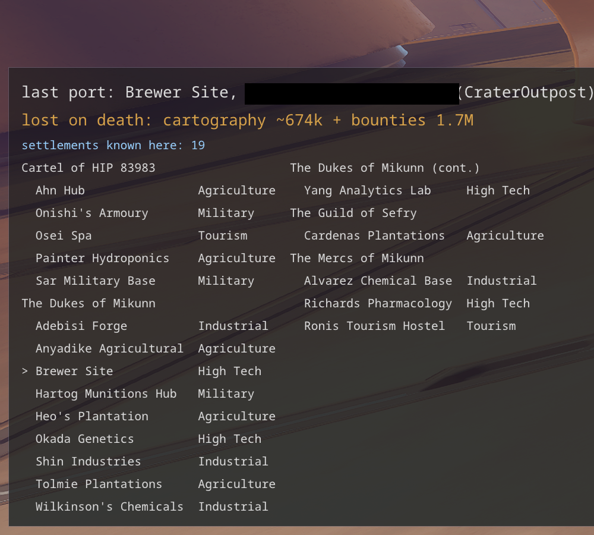

# On-foot missions

The job boards and combat tracking that only apply when you are out of the ship. Ship-based
mission tracking (courier, delivery, massacre...) is in [missions_space.md](missions_space.md); a
settlement's overall war status and its conflict zone intensity are read as part of
[bgs.md](bgs.md#bgs)'s "Settlements in a war".

- **Who holds which settlement**: on foot in a port or at a settlement, where the mission boards
  are, a small list in the left band shows the system's settlements under the factions holding
  them, both in alphabetical order, each with its economy, flowing into a second and third column
  when long. The settlement you stand at is marked with an arrow and painted green. The board
  never says whose a settlement is, and a job there moves that faction's influence. Only
  settlements you have visited or flown close to are known. Each other one gets its distance: in Ls
  from wherever you stand now, when both its own body and yours have been scanned - real orbital
  positions at this instant, not the raw distance-from-star the journal writes, which two bodies on
  opposite sides of the same star can share - or, for one on the same body as you, a real surface
  distance in m/km, once both settlements have been approached at least once to record where on the
  body each one stands.
- **On foot**: the consumables used up (grenades by type, medkits, energy cells, e-breaches), and
  the kills on foot, conflict zones apart from settlements. The game does not say what made a kill,
  so a kill 2 to 4 seconds after a frag grenade was thrown counts as the grenade's - the delay at
  which kills stand out from the rest in the journals. The weapon in hand is read from
  `Status.json` five times a second and is known only for kills seen live; a weapon changed in the
  kill's own second leaves it unknown, since the file's time goes to the second only.
