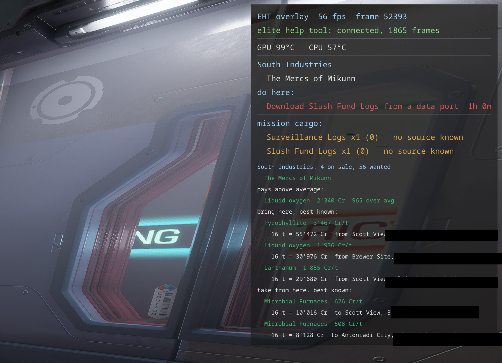

# Space missions

Mission tracking for the missions the game hands out for your ship: courier, delivery, massacre,
passenger and the rest. On-foot job boards and ground conflict zones are their own thing, in
[missions_on_foot.md](missions_on_foot.md).

- **Missions window**: every open mission with its status, type, description, faction, count,
  reward and destination, ready ones in their own colour. A *Massacre Stacking* tab sums the kills
  wanted and done per target system and faction.
- **On the overlay**: open missions grouped by the place they are owed to, with the time left, the
  giving faction and the owner of the destination. Missions ready to hand in are marked green, and
  those with less than 3 hours left turn red.
- **Where to go**: arrows on the system map at the bodies and ports missions send you to. At a
  settlement, what to hand in here, what to do here, and the faction-wide jobs that count at any
  settlement of that faction.
- **Mission cargo**: the goods delivery missions still need against what is in the hold, and the
  known markets and producers that supply them - "no source known" only for something a market could
  plausibly sell; a micro resource (Data downloaded off a terminal, Goods or Assets picked up or
  stolen at a settlement - a Surveillance Logs, a Nutritional Concentrate) never sits in a station's
  market at all, so it is never flagged that way.
- **What is really paid**: the reward is taken from the hand-in, not from the offer, and missions
  the game no longer lists expire by themselves.
- **What a death would cost**: unsold exobiology, cartography and bounties at risk, moved to the
  middle of the screen when the danger is immediate.
- **Who probably holds a bounty on you**: the factions you committed crimes with a bounty against
  since you last paid their bounties, the last of them within 7 days (`overlay.bounty_days`), with its
  date - and, for a squadron with Notoriety Decay, whose crimes add up to more than one step of it
  (100k) or were within the last two hours. The notoriety the game wrote at your last login stands
  beside it, with that login's own time - the game decays it quietly afterwards with no event of its
  own to say so, so this is what it was then, not necessarily what it is now. When the destination or
  the port you are docked at belongs to one of them, the overlay
  warns you to pay first. The sums are not shown: the game writes them to no file and counts them in
  amounts the journal does not record.
- **Your legal state here**: when you are anything but clean in the current system (Wanted, Hostile,
  Speeding...) - which is the controlling faction's jurisdiction only.
