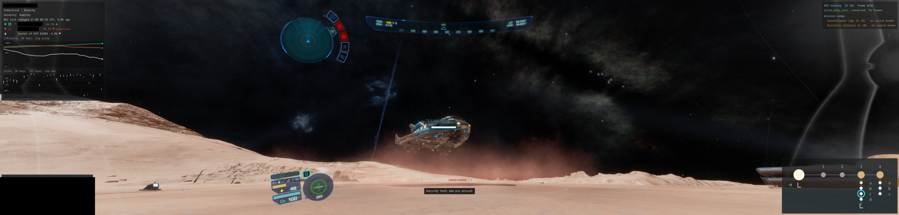
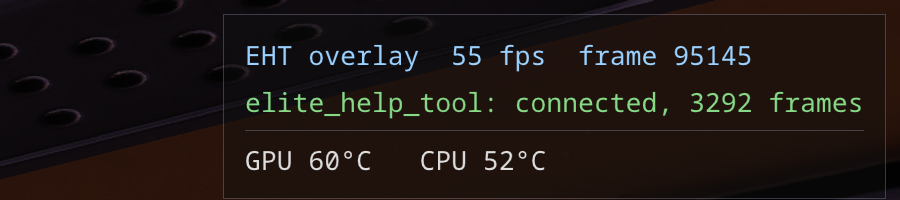
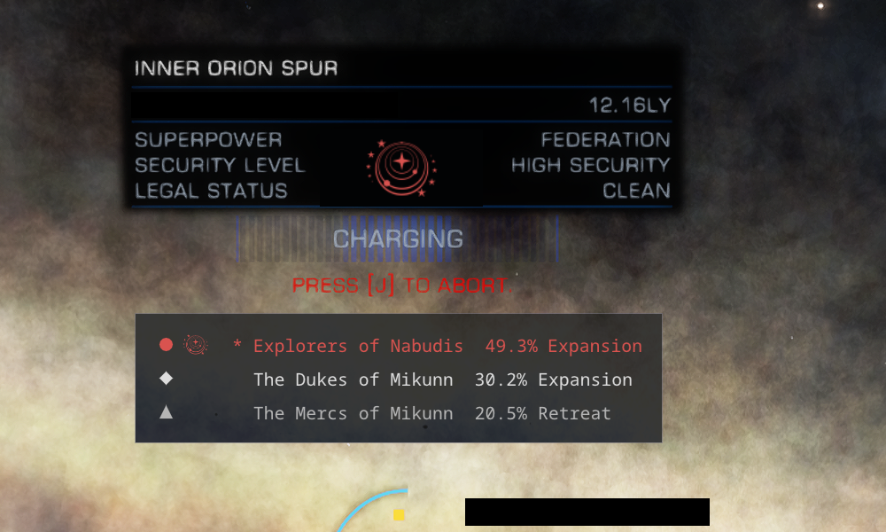

# In-game overlay

A Vulkan layer loaded into the game's process draws EHT's information straight into the frame. It
works in fullscreen, and under Wayland, where no other window may sit on top of the game. The
layer only draws what the tool sends it. The database and the logic stay in EHT, so the game
process carries no state of ours.

- **Side bands.** On a wide or triple screen the middle belongs to the game, so the blocks stay in
  the side bands and long text wraps instead of growing towards the centre.
- **Head-up readouts** flank the centre of the middle screen: the target in a fight, crew, and the
  sample in progress on foot. They give way to any interface that takes over that screen, such as
  the galaxy map.
- **Dogfights.** The target readout, on the left of centre, fills in as the scan goes: ship, pilot
  and combat rank, then hull and shield in per cent, then faction, legal status, bounty and the
  targeted subsystem with its health. On the right stand your hired pilot with their rank and the
  fighter's state: out and who flies it, in the bay, or destroyed and being rebuilt. A kill stays on
  screen for a few seconds with the victim's faction, the credits it paid and, marked "paid by", the
  factions that paid them - other factions than the victim's, the ones that had the bounty on it.
  When the danger is now (heat, an interdiction, the game's own danger warning), what a death would cost moves to the
  middle of the screen. Both readouts stand where you look during a fight, clear of the crosshair.
- **What stands where:** the system and its exploration work on the right, the station's market
  and mission cargo top right, the route, cargo, missions and what a death would cost on the left.
- **Last port:** where an escape pod would take you, beside the ships in transit, with its distance
  in light years when its system's position is known. Only ports count: not on-foot settlements,
  fleet carriers, construction sites or the colonisation ship.
- **System map:** the bodies and ports of the current system, drawn in the game's colours, with
  arrows at the places open missions send you to. Stars and planets are small lit balls: each planet
  and moon is lit from its star's side, water and ice shine a little, bare rock does not, and a star
  lights itself with only a darker limb. A body the surface scanner has been on wears its own face,
  cut out of the scanner's views (see [Faces of the planets](exploration.md#faces-of-the-planets)), and
  a face with life on it gets a green ring. A body with an atmosphere wears it as a veil in the
  colour of its main gas - nitrogen pale blue, oxygen blue, sulphur dioxide yellow, methane
  turquoise, argon violet, neon pink, vapours orange - faint over the face, thickest at the limb
  and glowing a little past it, reaching further for thick air than for thin. The balls are shaded on the graphics card as they are
  drawn, the faces read on a thread of their own and copied into one texture a few at a time, which
  together costs the game a few microseconds a frame.
- **Readable over anything.** The ground under each block darkens by how bright the game is
  beneath it, so the text stays legible over an ice planet as over black space.
- **F11** saves a screenshot of the whole screen, overlay included.
- **A small sample of the screen** for the tool to watch: when asked, the layer shrinks the middle of
  the game's image on the graphics card - halving it blit after blit, each step the mean of 2 x 2
  pixels - to a few hundred pixels across and writes it into a file shared with the tool, read out
  only once the frame's fence has passed. The tool looks for what it wants in the sample and then asks
  for a real picture of just the rectangle that holds it. It costs the game a few microseconds a frame.
  `overlay.sample.always` keeps the sample made at all times (`every_ms`, `size`, `width`), for looking at
  what the game shows from outside it; `overlay/tools/sample_to_png.py` turns the newest one into a PNG.
- **Temperatures.** Under the frame rate at the top of the right band stand the graphics card's and
  the processor's temperatures in degrees Celsius, orange from 10 degrees below the driver's
  critical level and red at it (3 degrees of hysteresis). They are read from `/sys/class/hwmon`,
  which every user may read - no root, no group, nothing written - in a thread of their own every
  2 s, the sensors looked for after the start, so a missing one never holds anything back. The card
  is the one with the most video memory, by its hottest spot (junction) or else its edge, and a
  card that sleeps is not woken to be read; the processor is its hottest die (k10temp's Tccd,
  Tdie or Tctl, zenpower, coretemp's package, or the thermal zone). A card from NVIDIA with its own
  driver is asked through its library when it is installed. Where the driver gives no critical
  level, `sensors.gpu_critical` (100) and `sensors.cpu_critical` (90) stand in; `sensors.enabled`
  turns the line off, `sensors.interval_ms` sets the pace.
  With `evidence.dir` set (see [the settlement glare](settlement_glare.md)) a line goes every 10 s
  (`sensors.log_interval_s`) to the day's `<dir>/sensors-YYYY-MM-DD.jsonl` - `ts_utc`, `gpu_c`,
  `gpu_sensor`, `pci`, `cpu_c`, `cpu_sensor`.

  
- **Jump panel.** While the drive charges for a jump to another system, the game shows the
  destination's superpower emblem, and it is wrong for the Federation, the Empire and the Alliance
  (only independents get the right one). The overlay paints over it with the right emblem, and
  lists the destination's factions under the panel with their influence and the last tick's trend.
  It knows only systems already in its database: on a first visit, and in unpopulated space while
  exploring, it leaves the panel as the game draws it and shows no list.

  

The layout (text size, band widths, where the readouts stand, opacity) comes from
`eht_settings.json` and changes live. The Steam launch option is one variable:
[building_and_running.md](building_and_running.md). How the layer works and why nothing in
it can take the game down: [overlay/README.md](../overlay/README.md).
