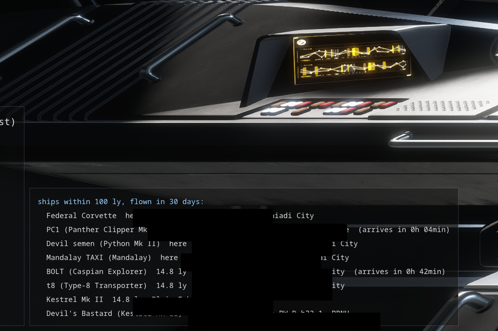

# Your ships

- **The Ships window** lists every ship you own: its name, type and ID, the system and port it stands
  at, how far that is from where you are, its value, and whether it is the one you fly, in transit
  (with the arrival time) or standing on a carrier. The nearest come first.
- **On the overlay**, bottom left, in a column of its own beside the stack there, the ships within
  100 ly of you (`overlay.ships_radius_ly`, 0 turns it off) that you have flown in the last 30 days
  (`overlay.ships_flown_days`, 0 lists every one nearby), the nearest first, up to 8 rows
  (`overlay.lists.ships`). A ship counts as flown once you have undocked in it yourself, not in a taxi
  or as crew; taking it out at a shipyard is not enough.
- The game writes the whole fleet only when you open a shipyard, and leaves out the ship you fly.
  Between two visits EHT follows the swaps, purchases, sales, renames and transfers. A transfer ordered
  while EHT saw it keeps its destination and arrival time. A ship left on one of our carriers moves
  with the carrier's jumps.
- A distance is known only for systems whose position is in `galaxy.sqlite`, that is ones you or the
  other account have been to. The rest stay at the bottom with a question mark.
- The ship you fly is taken to be where you are, even when you have taken a taxi away from it.
- Leaving by escape pod leaves the ship at the pad it was docked at, as a rule a carrier, and the list
  keeps it there. The game still calls it the active ship and, at the next shipyard, writes it as
  stored at that shipyard; EHT ignores that and keeps it where the pod left it.
