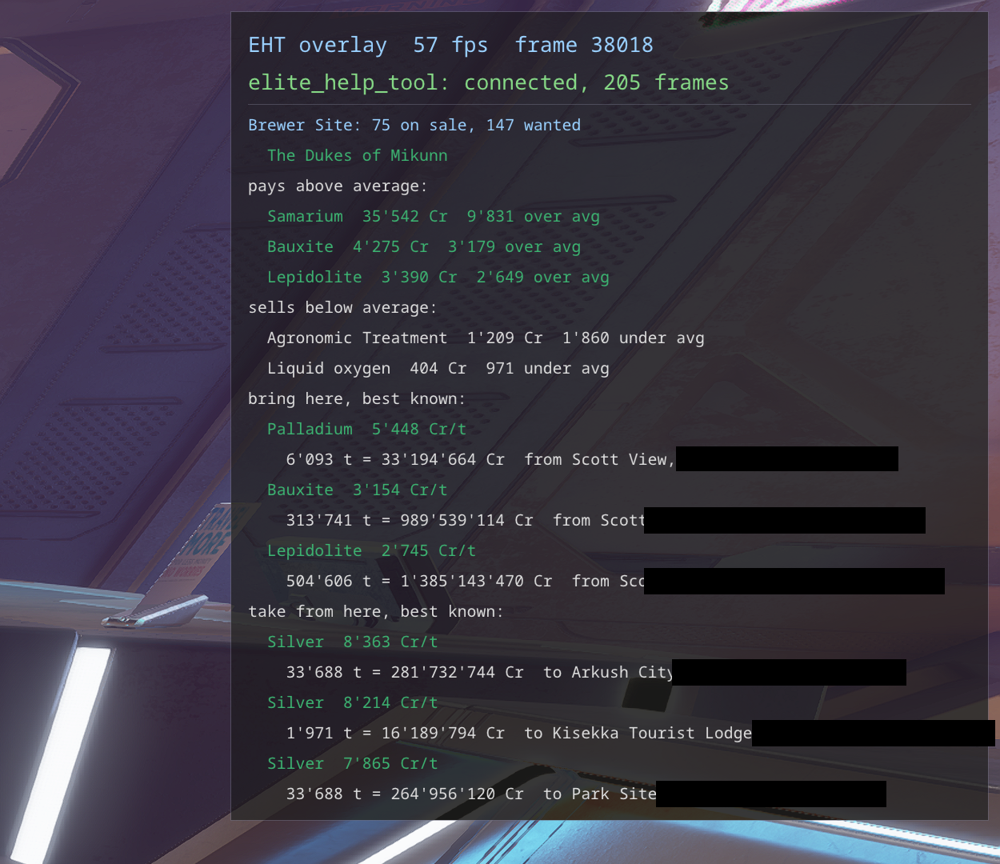

# Trade

- **The station's market on the overlay**: what it pays above and sells below the galactic
  average, beyond 25% and 500 Cr/t, with minerals that pay well only from mining listed apart. A
  market never opened says so in the side band - easy to miss - and, for a ship actually docked
  there (not a taxi ride, not an on-foot arrival), a second, wide reminder across the top middle of
  the screen in the ordinary overlay size: *open the Commodities Market to record it*
  (`overlay.market_reminder`, its own place and width, on by default).
- **"controlling faction changed since last reading - reopen the market"** (`market_stale` colour):
  the market has a reading, but the station's controlling faction has since changed and the market
  itself was never reopened. The game gives no notice when this happens, and what is legal to trade
  can depend on who runs the place, so the old reading may no longer be trustworthy.
- **Best known trades**: what to bring here and what to take from here, against every market you
  have ever opened. Each line gives the margin per tonne, the tonnes (capped by your hold, the stock
  and the demand), the profit of the run and the station. With a route plotted, it looks for what to
  take to its end and what to bring back.
- **Fleet carrier bars**: the bartender's shelf of every carrier visited, with prices and sold-out
  items, filterable to your own carriers. Where each material came from is tracked too, collected
  or from missions, over 30 days, 90 days or all time.
- **Bartender**: what you sold to bartenders, bought and bartered, item by item and summed by
  category (goods, assets, data), with the credits of sales and purchases. The game's own
  `Statistics` already count Horizons material traders, so they are not repeated here.
- **Bar sales** of your own carrier: the game never says a player bought from your bar, but the
  shelf does. Read the bartender on arriving, before adding anything, and again after: a fall in
  stock between readings is a sale at the price shown before it, a rise is what you added. Per
  item: units sold, revenue, in how many absences it sold at all out of those it lay on the
  shelf, and the price against a port's bartender. The port price comes from a built-in list of
  what a port's bartender pays, the same at every port (185 kinds, from the item pages of the Elite
  Dangerous wiki, checked against the prices worked out from real sales). The few rare kinds the
  list lacks are worked out from your own sales at ports - a sale of one kind gives its price, a
  sale where all kinds but one are known gives that one. A reading with no stock and no price
  anywhere, written before the bar has loaded, is skipped; a shelf sold out keeps its prices and
  counts as sold. Data, goods and assets
  are listed apart, each with its sums over the heading.
- **Mission value**: which kinds of mission pay best at your carrier's bar - what their material
  rewards fetch there, per mission and in all. The missions' credits are not counted.
  *Sold* is what the rewards have brought: each piece at what one piece put on the shelf has brought
  so far, the revenue of its kind over all the pieces put up (the first reading's stock and every
  rise since). *At the bar* is an estimate instead: the price on the bar times the share of absences
  the kind sold in there, so a price nobody pays counts for little. A kind never put on the bar takes a port's
  price when known and is otherwise counted as unvalued. Mission versions (`_004`, `_007`) are
  counted as one kind. Data and goods are listed apart; assets are left out, as they sell for next
  to nothing. The average is over all the missions of a kind, those that gave nothing of the
  category too.

On-foot consumables and kills are tracked too, but that lives with the rest of the on-foot combat
tracking in [missions_on_foot.md](missions_on_foot.md).

Market data is recorded when you open the commodity market, and kept in `live.sqlite`, the one
database that cannot be rebuilt from journals.
